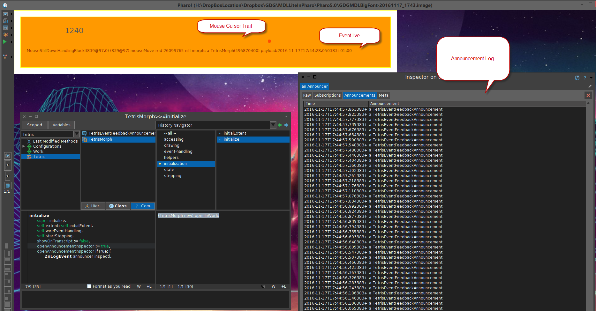
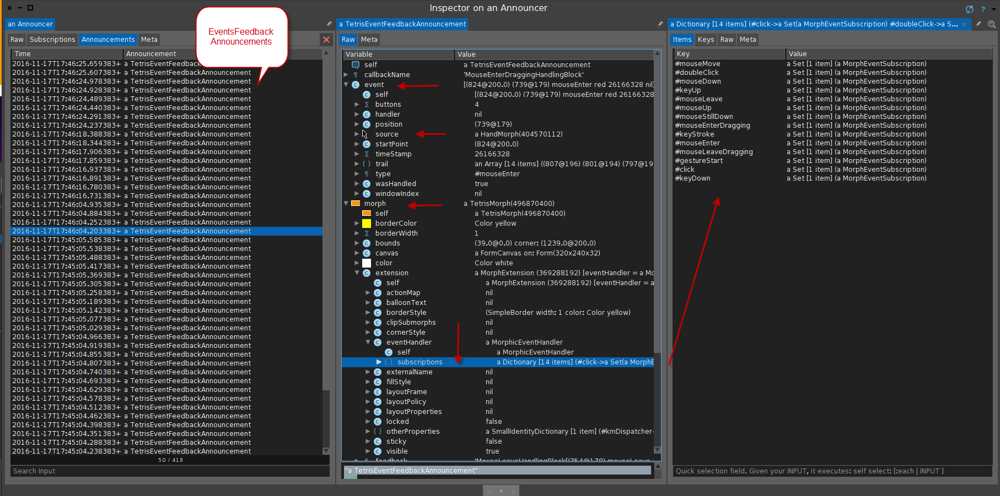

#Tetris

Well, maybe one day this will be Tetris but it morphed into an exploratory journery into Morphic Event Handling.

To load in Pharo 5.0

```Smalltalk

Metacello new
    githubUser: 'Pharophile' 
    project: 'Tetris' 
    commitish: 'master' 
    path: 'packages';
    baseline: 'Tetris';
    onWarningLog;
    load
```

So, this helps in seeing what is going on with events and handlers in Morphic.



The announcer can be inspected as I am using the ZnLogEvent annoucer. Inspecting is with GTInspector is easy.




